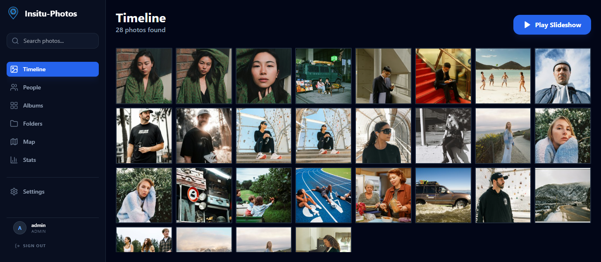
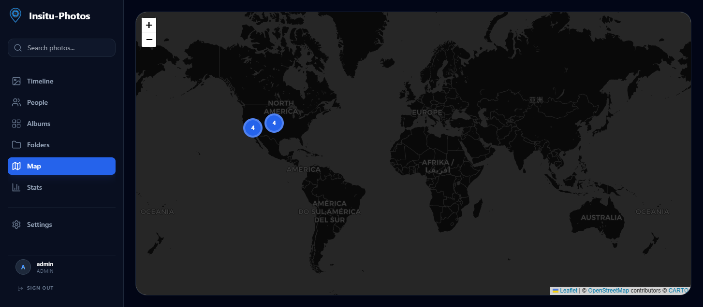
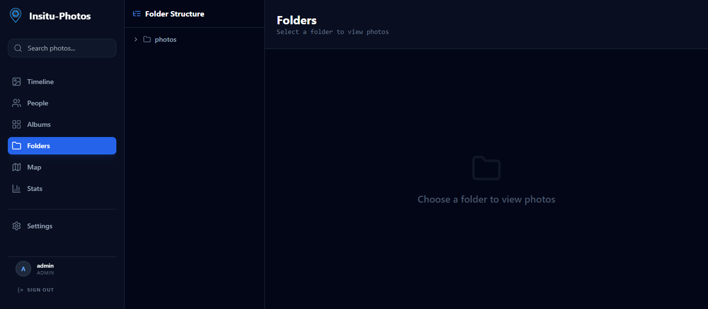
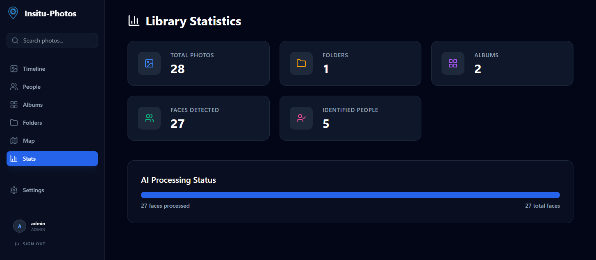
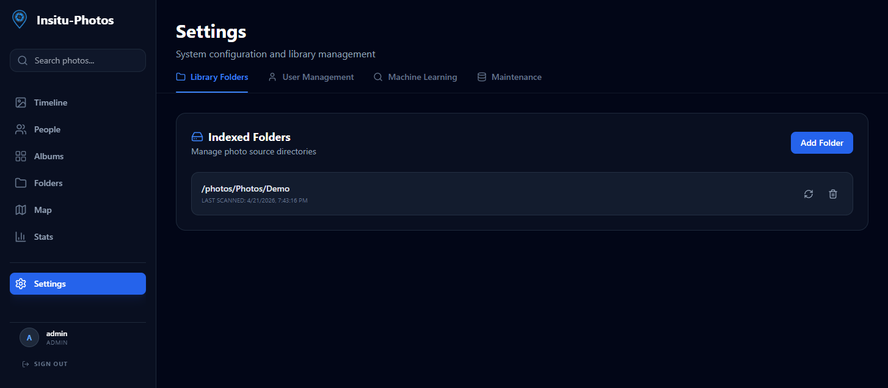

<p align="center">
  
</p>

# Insitu-Photos 📸

[](https://github.com/esapozhnikov/insitu-photos/actions/workflows/ci.yml)
[](https://github.com/esapozhnikov/insitu-photos/actions/workflows/release.yml)

**Self-hosted, high-performance photo management optimized for Unraid.**
*Read-only indexing that never touches, moves, or modifies your original files.*

## 📖 Table of Contents
* [✨ Features](#-features)
* [📸 Showcase](#-showcase)
* [🚀 Quick Start](#-quick-start)
* [🏔️ Unraid Setup](#-unraid-setup)
* [🛠️ Tech Stack](#-tech-stack)
* [⚖️ License](#-license)

## 📸 Showcase

### ⚡ High-Performance Timeline
Smoothly navigate libraries of 10,000+ photos with virtualized grids. Preserve your original memories exactly where they live.



### 🤖 AI Face Recognition
Automatically group faces using InsightFace (buffalo_l model) and manage people in your collection.


### 🌍 Interactive Map
Discover your photos on a world map with intelligent clustering and metadata-based location tracking.



### 📍 In-Situ Indexing & Folders
Read-only access to your photo library. Your folder structure is preserved and untouched.



### 📊 Stats & Monitoring
Built-in dashboard for library statistics and OpenTelemetry support for system telemetry.



### ⚙️ Admin & Settings
Easy configuration for ML thresholds, server paths, and user management.



## 🚀 Quick Start

### 1. Preparation
Clone the repository and prepare your environment:
```bash
cp .env.example .env
```

### 2. Configuration
Edit your `.env` file to match your server paths:
- `HOST_PHOTO_PATH`: The root directory of your photo collection (e.g., `/mnt/user/photos`).
- `HOST_APPDATA_PATH`: Where Insitu-Photos should store its database and cache (e.g., `/mnt/user/appdata/insitu-photos`).

### 3. Launch
```bash
docker-compose up -d
```
Access the UI at `http://localhost:3000`.

## 🏔️ Unraid Setup
For Unraid users, we provide a streamlined setup script:
1. Copy `setup_unraid.sh` and `docker-compose.unraid.yml` to your server.
2. Configure `.env` as described above.
3. Run `bash setup_unraid.sh`.
4. Run `docker-compose -f docker-compose.unraid.yml up -d`.

The UI will be available at `http://<unraid-ip>:3001`.

## 🛠️ Tech Stack
*   **Frontend:** React, TypeScript, Tailwind CSS, Leaflet.
*   **Backend:** FastAPI, SQLAlchemy, Celery, Redis.
*   **AI:** Immich-ML (InsightFace) with optional NVIDIA GPU acceleration.
*   **Database:** PostgreSQL with `pgvector`.

## ⚖️ License
Distributed under the MIT License. See `LICENSE` for more information.
